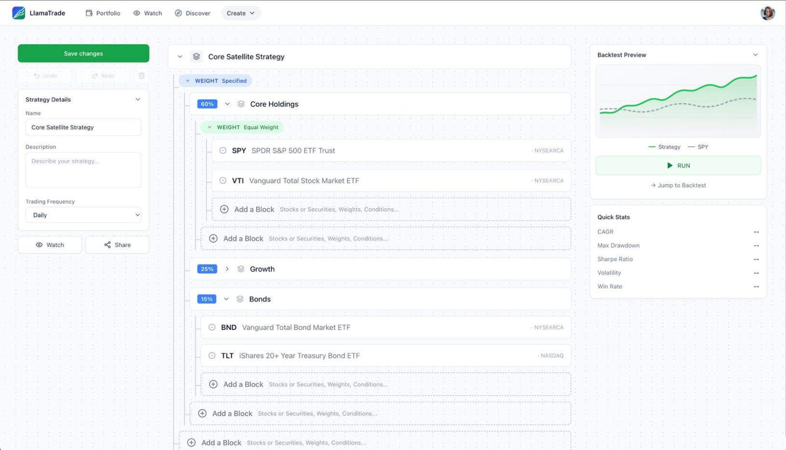

# LlamaTrade

**Open-source algorithmic trading platform** — Build strategies, backtest on historical data, and execute live trades via Alpaca Markets.



## Features

- **Visual Strategy Builder** — Create trading strategies without writing code using a node-based editor
- **Pre-built Strategies** — MA Crossover, RSI, MACD, Bollinger Bands, Donchian Breakout, and more
- **Backtesting Engine** — Test strategies against historical market data with detailed metrics
- **Live Trading** — Paper and live trading via Alpaca Markets API
- **Multi-tenant SaaS** — Built for scale with proper tenant isolation
- **Real-time Data** — WebSocket streaming for live market data and order updates

## Architecture

```
    🦙  LlamaTrade — strategies in, orders out
╭──────────────────────────────────────────────────────────────────────────────────╮
│                                  USER  BROWSER                                   │
│                         you · your team  (multi-tenant)                          │
╰──────────────────────────────────────────────────────────────────────────────────╯
                                          │
                                        Connect · HTTP/1.1 + JSON · JWT · no gateway
                                          ▼
╭──────────────────────────────────────────────────────────────────────────────────╮
│                            web · 8800   —   React SPA                            │
│           visual builder · backtests · trading & portfolio dashboards            │
╰──────────────────────────────────────────────────────────────────────────────────╯
                                          │
        ┬────────────────┬────────────────┴────────────────┬────────────────┬
        ▼                ▼                ▼                ▼                ▼
     sign in           build            test             live            assist
╭──────────────╮ ╭──────────────╮ ╭──────────────╮ ╭──────────────╮ ╭──────────────╮
│ auth · 8810  │ │strategy·8820 │ │backtest·8830 │ │ trading·8850 │ │ agent · 8890 │
│ JWT·tenants  │ │ parse · ver  │ │  Celery sim  │ │orders⇄Alpaca │ │   AI → DSL   │
╰──────────────╯ ╰──────────────╯ ╰──────────────╯ ╰──────────────╯ ╰──────────────╯

                 ╭──────────────╮ ╭──────────────╮ ╭──────────────╮
                 │ market-data  │ │ billing·8880 │ │ notification │
                 │ 8840 bars+WS │ │Stripe·limits │ │ 8870 alerts  │
                 ╰──────────────╯ ╰──────────────╯ ╰──────────────╯
                                          │
                                            terminal fills · exactly-once
                                          ▼
╔══════════════════════════════════════════════════════════════════════════════════╗
║               portfolio · 8860   —   THE LEDGER  ★ book of record                ║
║             sleeves · lots · double-entry events · per-strategy P&L              ║
╚══════════════════════════════════════════════════════════════════════════════════╝
                                          │
  Postgres (RLS)  ·  Kafka (fills · progress · bars)  ·  Redis (cache · Celery)  ·  Alpaca (WS + REST)
```

## Tech Stack

| Layer              | Technology                                            |
| ------------------ | ----------------------------------------------------- |
| **Frontend**       | React 18, TypeScript, Vite, Tailwind CSS, Zustand     |
| **Backend**        | Python 3.14+, FastAPI, SQLAlchemy, Pydantic           |
| **API Protocol**   | gRPC + Connect (HTTP/1.1 JSON for browser, HTTP/2 S2S)|
| **Data & Events**  | PostgreSQL 16, Redis 7, Kafka                         |
| **Infrastructure** | Docker, Kubernetes (GKE), Terraform                   |
| **CI/CD**          | GitHub Actions                                        |

## Quick Start

### Prerequisites

- Docker & Docker Compose
- Python 3.14+ (for local development)
- Node.js 20+ (for frontend)
- [Alpaca Markets](https://alpaca.markets/) account (free paper trading)

### 1. Clone and Configure

```bash
git clone https://github.com/your-org/llamatrade.git
cd llamatrade

# Copy environment template
cp .env.example .env

# Add your Alpaca API keys to .env
# ALPACA_API_KEY=your_paper_api_key
# ALPACA_API_SECRET=your_paper_api_secret
```

### 2. Start Development Environment

**Option A: Docker (recommended for first run)**

```bash
make dev
```

**Option B: Local Python (faster hot-reload)**

```bash
# Start infrastructure only
make dev-infra

# Run all services at once (uses honcho)
make dev-local

# Or run individual services in separate terminals
make dev-local SERVICE=auth
make dev-local SERVICE=strategy
# ... etc
```

### 3. Access the Application

| Service     | URL                   |
| ----------- | --------------------- |
| Frontend    | http://localhost:8800 |
| Auth        | http://localhost:8810 |
| Strategy    | http://localhost:8820 |

## Project Structure

```
llamatrade/
├── apps/
│   ├── core/                # @llamatrade/core — shared stores, net, proto, format
│   ├── mobile/              # Expo React Native app
│   └── web/                 # React frontend (+ marketing landing)
├── services/
│   ├── auth/                # Authentication & users
│   ├── strategy/            # Strategy management
│   ├── backtest/            # Backtesting engine
│   ├── market-data/         # Real-time & historical data
│   ├── trading/             # Order execution
│   ├── portfolio/           # Positions, P&L, ledger
│   ├── notification/        # Alerts & webhooks
│   ├── billing/             # Subscriptions (Stripe)
│   └── agent/               # AI copilot (NL → DSL)
├── libs/
│   ├── alpaca/              # Alpaca REST + WebSocket clients
│   ├── common/              # Middleware, auth, shared models
│   ├── db/                  # SQLAlchemy models, migrations, RLS
│   ├── dsl/                 # Strategy DSL parser
│   ├── events/              # Kafka event bus
│   ├── proto/               # Protocol Buffers + generated Connect code
│   ├── runtime/             # Shared strategy runtime (backtest + live)
│   └── telemetry/           # OpenTelemetry + Prometheus
├── infrastructure/
│   ├── docker/              # Docker Compose configs
│   ├── k8s/                 # Kubernetes manifests
│   └── terraform/           # GCP infrastructure
└── .docs/                   # Documentation
```

## Development

```bash
# Run tests
make test

# Lint & type check
make lint

# Auto-fix linting issues
make lint-fix

# See all available commands
make help
```

## Built-in Strategies

| Strategy          | Type           | Description                        |
| ----------------- | -------------- | ---------------------------------- |
| MA Crossover      | Trend          | Fast/slow moving average crossover |
| RSI Reversal      | Mean Reversion | Buy oversold, sell overbought      |
| MACD              | Momentum       | MACD line + signal line crossover  |
| Bollinger Bounce  | Mean Reversion | Trade bounces off bands            |
| Donchian Breakout | Trend          | Turtle trading channel breakout    |

The full template library (~80 strategies) is served by the strategy service (`ListTemplates`).

## Deployment

```bash
# Deploy to staging (manual: workflow_dispatch in GitHub Actions, or directly)
make deploy-staging

# Deploy to production (manual)
make deploy-prod

# Infrastructure provisioning
make tf-plan
make tf-apply
```

## Documentation

Full documentation lives in [`.docs/`](.docs/). New here? Start with the [Architecture Guide](.docs/architecture.md).

### Core references

| Document | Covers |
| -------- | ------ |
| [Architecture](.docs/architecture.md) | System design, service topology, Connect/gRPC communication, deployment, multi-tenancy & RLS |
| [Strategy DSL](.docs/strategy-dsl.md) | The S-expression strategy language — syntax, compilation, evaluation semantics |
| [Signals & Weights](.docs/signals-and-weights.md) | Technical-indicator and portfolio-allocation reference: what the DSL supports and how each is used |
| [Portfolio Ledger](.docs/portfolio-ledger.md) | How target weights become trades: sizing, sleeves, lots, the event-sourced double-entry ledger, reconciliation, and the **money-movement integration contract** (single source of truth) |
| [Execution Runtime](.docs/execution-runtime.md) | The shared backtest + live execution loop: `StrategySession`, the runtime adapters, and backtest↔live parity |
| [Trading Strategies](.docs/trading-strategies.md) | Algorithmic trading concepts and strategy approaches |
| [Asset Classes](.docs/asset-classes.md) | Tradeable asset-class reference |

### Cross-cutting infrastructure

| Document | Covers |
| -------- | ------ |
| [Telemetry & Observability](.docs/telemetry.md) | `llamatrade_telemetry` — metrics, structured logs, traces, conventions, and the metric catalog |

### Services

| Service | Port | Covers |
| ------- | ---- | ------ |
| [Auth](.docs/services/auth.md) | 8810 | Authentication, JWT, RBAC, Alpaca credential storage & OAuth |
| [Strategy](.docs/services/strategy.md) | 8820 | Strategy CRUD, DSL parsing, templates, execution lifecycle |
| [Backtest](.docs/services/backtesting.md) | 8830 | Historical backtesting over Celery, metrics calculation |
| [Market Data](.docs/services/market-data.md) | 8840 | Real-time & historical data via Alpaca (REST + WebSocket) |
| [Trading](.docs/services/trading.md) | 8850 | Order execution, risk management, positions, ledger fills |
| [Portfolio](.docs/services/portfolio.md) | 8860 | The ledger — sleeves, lots, per-strategy P&L, book of record |
| [Notification](.docs/services/notification.md) | 8870 | Alerts and channels (email, SMS, Slack) |
| [Billing](.docs/services/billing.md) | 8880 | Stripe subscriptions, checkout, plan limits |
| [Agent](.docs/services/agent.md) | 8890 | AI copilot — natural-language strategy building |

### Decisions & planning

- **ADRs** — [Gateway vs Direct Communication](.docs/decisions/gateway-vs-direct-communication.md) · [Tiingo vs Alpaca Market Data](.docs/decisions/tiingo-vs-alpaca-market-data.md)
- **Active plans** ([`.docs/planning/`](.docs/planning/)) — [MVP Release Plan](.docs/planning/mvp-release-plan.md) · [Platform Remediation Tracker](.docs/planning/platform-remediation-plan-2026-07-18.md) · [Broker Setup (BYO keys)](.docs/planning/broker-setup-individual-traders.md) · [Broker API Legal Checklist](.docs/planning/broker-api-legal-checklist.md)

## Contributing

Contributions are welcome! Please read our contributing guidelines before submitting PRs.

1. Clone the repository
2. Create a feature branch (`git checkout -b feature/amazing-feature`)
3. Commit changes (`git commit -m 'Add amazing feature'`)
4. Push to branch (`git push origin feature/amazing-feature`)
5. Open a Pull Request

## License

MIT License — see [LICENSE](LICENSE) for details.
